# Delivery Operations Intelligence Platform

> A frontend-heavy operations intelligence platform that helps restaurant teams identify, prioritize, and resolve costly delivery issues using AI-driven insights.

<p align="center">
  
</p>

## Problem

Third-party delivery platforms (DoorDash, UberEats, GrubHub) create significant **revenue leakage** for restaurant brands through:

- Missing items not refunded
- Late deliveries requiring customer compensation
- Cancellations after food preparation
- Failed chargebacks and dispute processes

Without a centralized system, operations teams spend hours manually tracking issues and recovering lost revenue.

## Solution

This platform provides restaurant operators with a **single pane of glass** to:

1. **Monitor** — Real-time KPIs showing revenue at risk and resolution status
2. **Identify** — AI-flagged issues prioritized by financial impact
3. **Analyze** — Root cause analysis with confidence scores
4. **Resolve** — One-click actions to file chargebacks, dismiss, or escalate

---

## How It Works

```mermaid
flowchart LR
    A[🔍 Detect] --> B[💰 Estimate]
    B --> C[🤖 Analyze]
    C --> D[👤 Decide]
    D --> E[📊 Recover]
```



| Step | What Happens |
|------|--------------|
| **1. Detect** | Identify delivery issues across all partners in real-time |
| **2. Estimate** | Calculate financial impact per order automatically |
| **3. Analyze** | Generate AI-powered root cause insights with confidence scores |
| **4. Decide** | Enable human decision-making: file chargeback, dismiss, or escalate |
| **5. Recover** | Track recovered revenue and resolution outcomes |

---

## Key Features

### Dashboard
- **5 KPI Cards**: Issues %, Revenue at Risk, Total Recovered, Chargebacks, Avg Resolution Time
- **Dynamic Filters**: Store, delivery partner, issue type, status
- **Recovered Amount Column**: See money recovered per order at a glance
- **Real-time Updates**: KPIs refresh after every action

### Issue Deep Dive
- **Order Metadata**: Store, partner, detection time
- **Financial Impact**: Estimated cost, expected recovery, actual recovered amount
- **AI Insight Panel**: Root cause, confidence score, recommended action
- **One-Click Actions**: File chargeback, dismiss, or escalate

### Recovery Tracking
- **Resolved**: Shows actual $ recovered (green)
- **Pending**: Escalated issues awaiting resolution (amber "Pending" badge)
- **Dismissed**: No recovery attempted (gray)

---

## Tech Stack

| Layer | Technology |
|-------|------------|
| Frontend | React 18, TypeScript, Tailwind CSS, Framer Motion |
| Backend | Python 3.10+, FastAPI |
| Animations | Framer Motion (subtle, purposeful) |
| Data | Mock data simulating real operations |

---

## Getting Started

### Prerequisites
- Node.js 18+
- Python 3.10+

### Installation

```bash
# Clone the repository
git clone <repo-url>
cd delivery-operations-intelligence

# Install frontend dependencies
npm install

# Install backend dependencies
pip install -r requirements.txt
```

### Running the Application

**Terminal 1 — Backend:**
```bash
cd backend
uvicorn app:app --reload --port 8000
```

**Terminal 2 — Frontend:**
```bash
npm run dev
```

Open [http://localhost:5173](http://localhost:5173) in your browser.

---

## API Endpoints

| Endpoint | Method | Description |
|----------|--------|-------------|
| `/dashboard` | GET | KPIs + paginated issues list |
| `/issues/{order_id}` | GET | Issue details + AI insight |
| `/issues/{order_id}/analyze` | POST | Generate AI insight |
| `/issues/{order_id}/action` | POST | Take action (file_chargeback, dismiss, escalate) |
| `/filters` | GET | Available filter options |

### KPI Response Fields

| Field | Description |
|-------|-------------|
| `issues_percentage` | % of total orders with issues |
| `revenue_at_risk` | Total $ pending resolution |
| `total_recovered` | Total $ recovered via chargebacks |
| `recovery_rate` | % of at-risk revenue recovered |
| `pending_recovery` | $ in escalated issues (pending) |

---

## Project Structure

```
├── backend/
│   ├── app.py           # FastAPI application
│   ├── models.py        # Pydantic data models
│   └── mock_data.py     # Realistic mock data generator
├── src/
│   ├── pages/
│   │   ├── Dashboard.tsx       # Main dashboard screen
│   │   └── IssueDetail.tsx     # Issue deep dive screen
│   ├── components/
│   │   ├── KPICard.tsx         # Animated metric cards
│   │   ├── IssuesTable.tsx     # Clickable issues table
│   │   ├── FilterBar.tsx       # Filter dropdowns + chips
│   │   ├── StatusBadge.tsx     # Status indicators
│   │   ├── EmptyState.tsx      # Empty/error states
│   │   └── Pagination.tsx      # Page navigation
│   ├── api.ts           # API service layer
│   └── types.ts         # TypeScript definitions
└── README.md
```

---

## Accessibility

- ✅ Keyboard navigation for table rows (Tab + Enter)
- ✅ Focus states on all interactive elements
- ✅ ARIA labels on action buttons
- ✅ Status badges use color + text (not color-only)
- ✅ Escape key returns to dashboard from issue detail

---

## Screenshots

### Dashboard


### Issue Deep Dive


---

## License

Apache License 2.0
